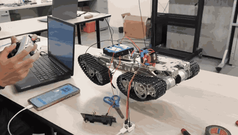

# Optimus
Optimus is an autonomous car built using Lora32, YOLOv8, ROS 2 and LiDAR sensors. You can find the full list of components in the [hardware components guide](docs/hardware-components.md).

<p align="center">
  
  <br>
  <em>Optimus tracks driven from a phone running OpenBot and an M5Stack AtomS3 (<a href="docs/media/working.mp4">full video</a>).</em>
</p>

## Quick start (OpenBot)

An Android phone running [OpenBot](https://github.com/ob-f/OpenBot) acts as the brain (camera, object detection, controller input) and the AtomS3 drives the motors.

### Requirements

- **Hardware:** M5Stack AtomS3, L298N motor driver with the ENA/ENB jumpers on, 12V battery, DC motors, Android phone, USB-C to USB-C **data** cable, optional Bluetooth gamepad (PS4, PS5 or Xbox).
- **Software:** [PlatformIO](https://platformio.org/install/cli) and Git on your laptop, the OpenBot APK on the phone ([install guide](https://github.com/ob-f/OpenBot/tree/master/android)).

### Run it

1. **Wire the motors:** AtomS3 `G5`/`G6` go to the left motor inputs and `G7`/`G8` to the right ones (change them in [`motors_config.h`](include/config/motors_config.h)). Share ground with the L298N.
2. **Flash the AtomS3** while it is plugged into your laptop:
   ```bash
   git clone https://github.com/rosvend/optimus.git && cd optimus
   pio run -e atoms3_openbot -t upload
   ```
3. **Connect the phone** to the AtomS3 with the USB-C cable and allow the USB permission prompt.
4. **Open OpenBot** and tap the USB icon. The baud rate should be `115200` and the robot type `OPTIMUS`.
5. **Drive:** pair your gamepad over Bluetooth, set the control mode to *Gamepad* and the drive mode to *Game* (R2 forward, L2 reverse, left stick steers). Start in *Slow* speed mode.
6. **Go autonomous:** pick an AI mode in the app, such as object tracking.

> **Safety:** speed changes are ramped and the tracks pause at zero before reversing, so a full direction flip takes about 3.5 s. Keep the tracks off the ground for your first tests.

### Other commands

```bash
pio test -e native                    # run the unit tests on your laptop
pio run -e atoms3 -t upload           # keyboard control over serial (w/s/a/d, space to stop)
```
